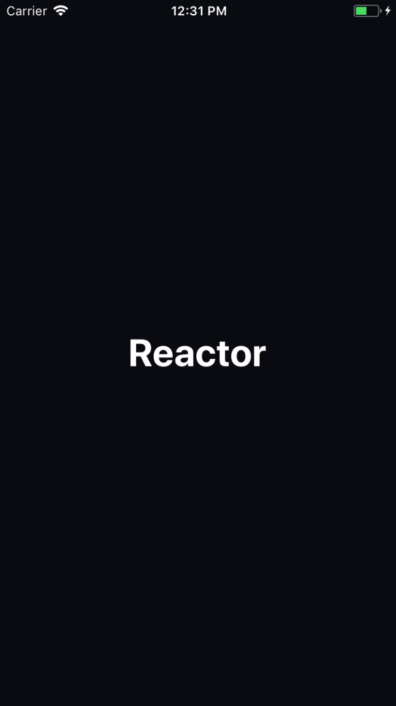
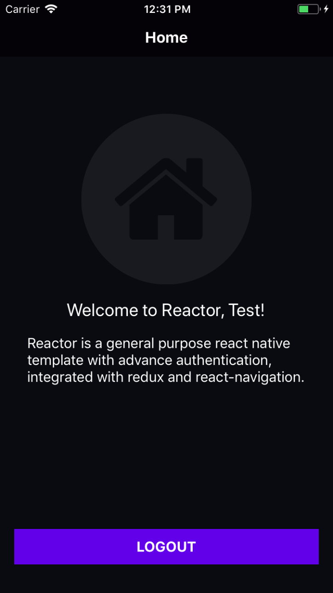

# Reactor v2
[](https://circleci.com/gh/Jerameel/Reactor/tree/master)

A general purpose react native template with advance authentication, integrated with **redux** and **react-navigation**.

<p float="left">
  
  
</p>
<p float="left">
  
  
</p>

## Usage

1. Create a new react native project

```bash
react-native init NewProject
```

2. Clone repository

```bash
git clone https://github.com/Jerameel/Reactor.git
```

3. Copy **src** folder to **NewProject**
4. Edit **index.js** to import **App** from **./src/index**
5. Install dependencies

```bash
yarn add react-native-vector-icons react-navigation redux react-redux redux-logger redux-thunk
```

6. Link native modules

```bash
react-native link
```

7. Run your application and modify as you needed

```bash
#Android
react-native run-android

#iOS
react-native run-ios
```

## License

Copyright 2018 Jerameel M. Delos Reyes

Licensed under the Apache License, Version 2.0 (the "License");
you may not use this file except in compliance with the License.
You may obtain a copy of the License at

       http://www.apache.org/licenses/LICENSE-2.0

Unless required by applicable law or agreed to in writing, software
distributed under the License is distributed on an "AS IS" BASIS,
WITHOUT WARRANTIES OR CONDITIONS OF ANY KIND, either express or implied.
See the License for the specific language governing permissions and
limitations under the License.
